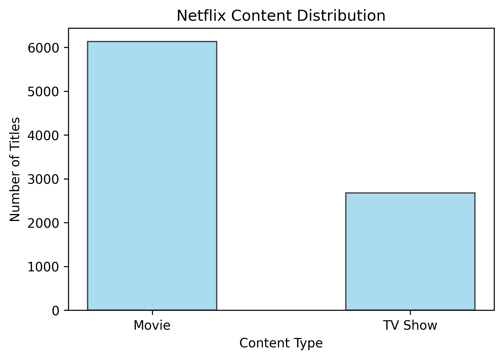
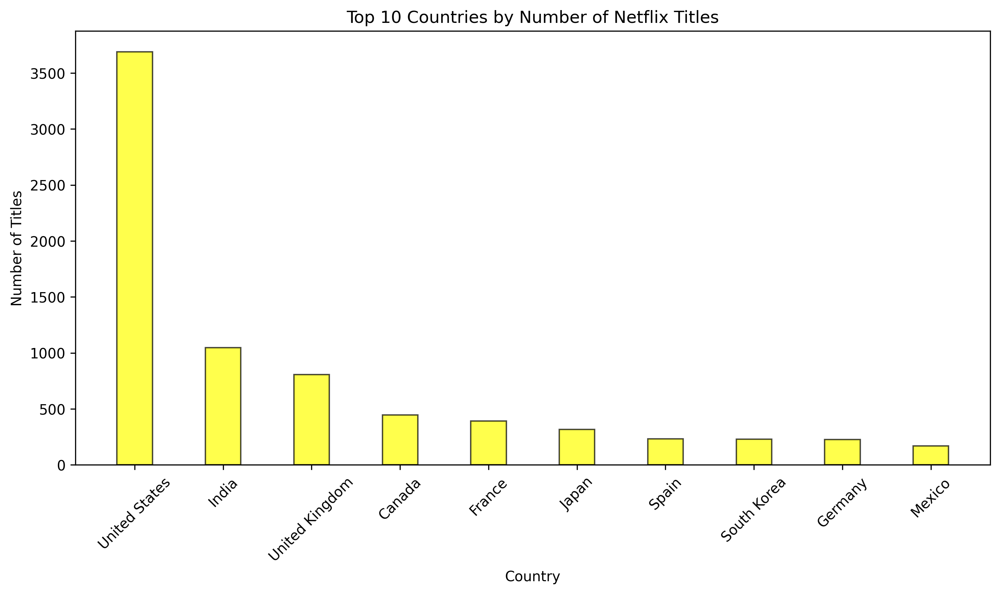
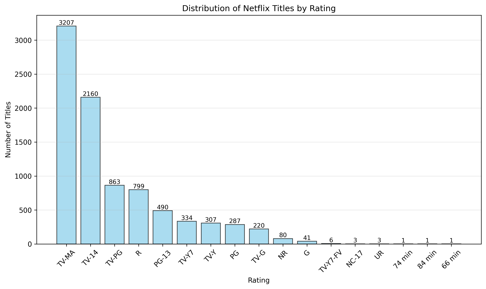
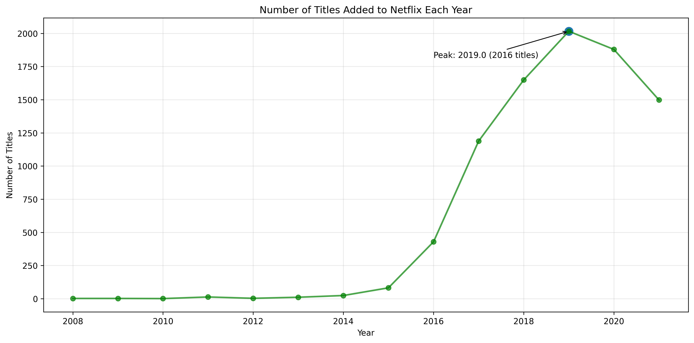
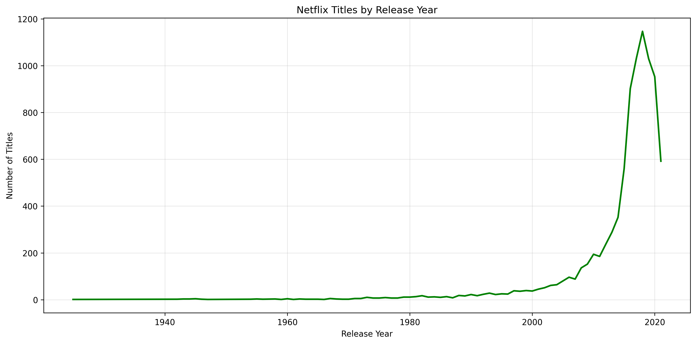
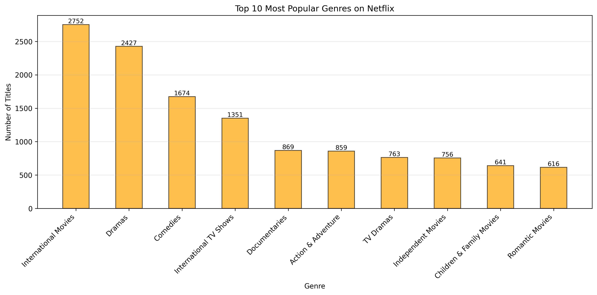
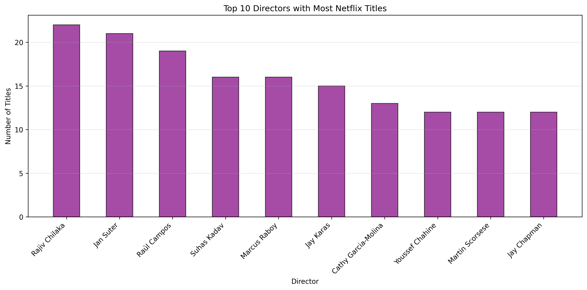
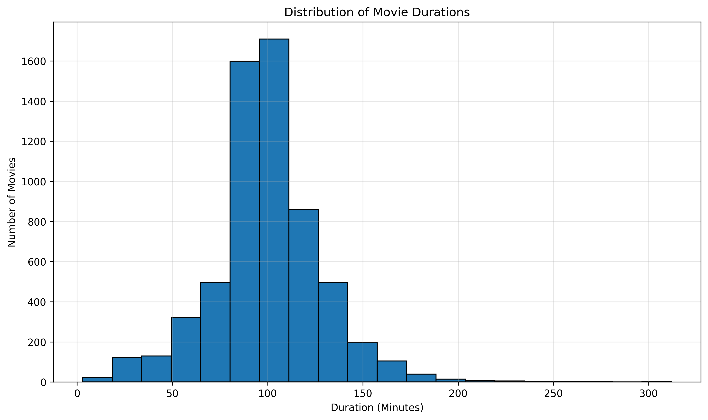

# Netflix Movies & TV Shows Data Analysis

An Exploratory Data Analysis (EDA) project that analyzes the Netflix Movies & TV Shows dataset using Python, Pandas, NumPy, and Matplotlib to uncover trends in content distribution, genres, ratings, release years, countries, and movie durations.

---

## Project Overview

The objective of this project is to explore Netflix's content catalog through data cleaning, preprocessing, visualization, and exploratory analysis. The analysis focuses on identifying meaningful patterns in the dataset and presenting them through clear visualizations.

The project demonstrates practical applications of:

- Data cleaning
- Exploratory Data Analysis (EDA)
- Data visualization
- Feature engineering
- Working with real-world datasets using Python

---

## Dataset

**Source:** Kaggle – Netflix Movies and TV Shows Dataset

**Dataset Summary**

- 8,807 titles
- Movies and TV Shows
- 12 original features
- Missing values handled during preprocessing

---

## Technologies Used

- Python
- Pandas
- NumPy
- Matplotlib
- Jupyter Notebook
- Git
- GitHub

---

## Project Structure

```
Netflix-Data-Analysis/
│
├── data/
│   └── netflix_titles.csv
│
├── images/
│   ├── movie_durations.png
│   ├── movies_vs_tvshows.png
│   ├── rating_distribution.png
│   ├── release_years.png
│   ├── titles_added.png
│   ├── top_countries.png
│   ├── top_directors.png
│   └── top_genres.png
│
├── notebooks/
│   └── Netflix_Data_Analysis.ipynb
│
├── README.md
├── requirements.txt
└── .gitignore
```

---

## Analysis Performed

### 1. Data Cleaning

- Examined dataset structure
- Checked data types
- Identified missing values
- Converted date columns to datetime format
- Extracted the year from `date_added`
- Processed movie duration values

### 2. Content Distribution

- Movies vs TV Shows

### 3. Country Analysis

- Split titles with multiple countries
- Counted each country individually
- Ranked countries by total number of titles

### 4. Netflix Library Growth

- Titles added each year
- Distribution of release years

### 5. Rating Analysis

- Distribution of Netflix content ratings

### 6. Genre Analysis

- Extracted individual genres
- Ranked the most common genres

### 7. Director Analysis

- Top directors by number of Netflix titles

### 8. Movie Duration Analysis

- Converted duration to numeric values
- Analyzed runtime distribution

---

## Key Findings

- Movies significantly outnumber TV Shows on Netflix.
- The United States contributes the highest number of titles.
- India is among the largest content-producing countries.
- Netflix experienced rapid growth in content additions between 2016 and 2019.
- Drama is the most common genre.
- Rajiv Chilaka appears among the directors with the highest number of Netflix titles.
- Most movies have durations between 80 and 120 minutes.

---

## Visualizations

### Movies vs TV Shows



### Top Producing Countries



### Distribution of Ratings



### Titles Added Per Year



### Release Year Distribution



### Top Genres



### Top Directors



### Movie Duration Distribution



---

## Installation

Clone the repository:

```bash
git clone https://github.com/Gauransh47/Netflix-Data-Analysis.git
```

Move into the project directory:

```bash
cd Netflix-Data-Analysis
```

Install the required packages:

```bash
pip install -r requirements.txt
```

Launch Jupyter Notebook:

```bash
jupyter notebook
```

Open:

```
notebooks/Netflix_Data_Analysis.ipynb
```

---

## Future Improvements

- Build an interactive dashboard using Plotly or Streamlit
- Perform sentiment analysis on title descriptions
- Analyze actor collaboration networks
- Develop a recommendation system
- Deploy the project as a web application

---

## Author

**Gauransh Pal**

GitHub: https://github.com/Gauransh47

LinkedIn: https://www.linkedin.com/in/gauransh-pal-11016b37a